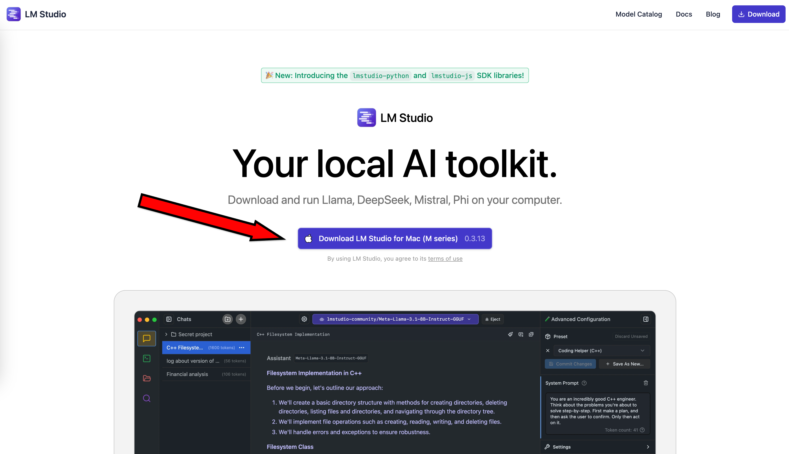
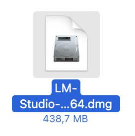
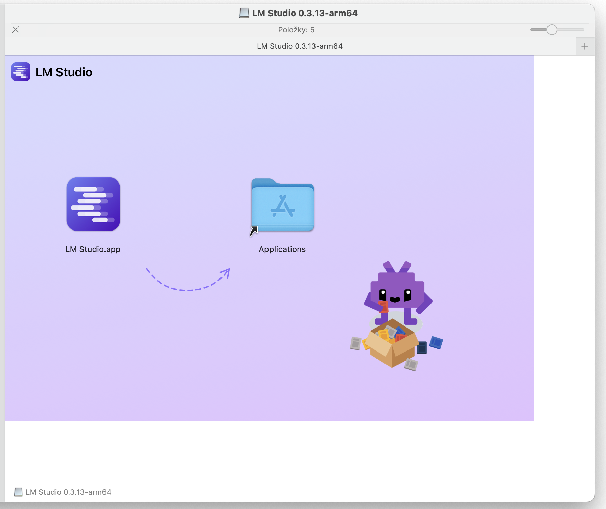
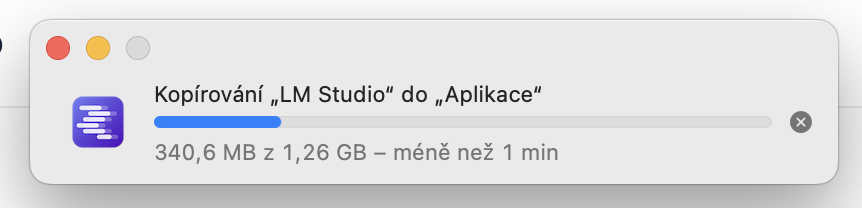
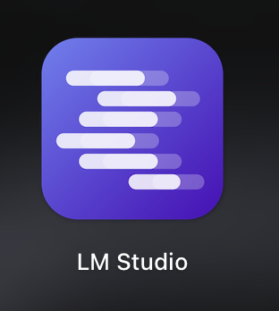
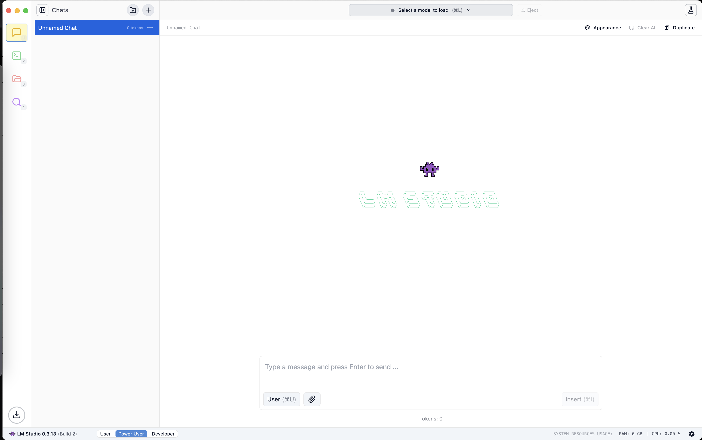

# Semestrální práce k předmětu PDO

## Cílová skupina osob

- macOS uživatel
- Windows uživatel
- Tvůrce receptů na vaření

# Tvůrce receptů na vaření

## LM Studio
LM Studio je nástroj pro práci s lokálními jazykovými modely. Umožňuje správu a použití různých modelů AI bez nutnosti připojení k internetu.

## Hlavní Funkce
 - Stahování modelů
 - Spouštění různých formátů modelů lokálně
 - Konfigurace možností spuštění
 - Vše v uživatelsky přívětivém rozhraní

## Instalace

### Požadavky na systém
- Operační systém: macOS / Linux / Windows
- Zbytek závisí na specifikacích jazykového modelu

### Stažení a instalace
1. Navštivte oficiální web LM Studia: [LM Studio](https://lmstudio.com)
2. Stáhněte instalační soubor podle vašeho operačního systému.
3. Spusťte instalační soubor a postupujte podle pokynů.
4. Po instalaci spusťte aplikaci.

## První spuštění a základní nastavení

### Spuštění aplikace
Po instalaci můžete aplikaci otevřít kliknutím na ikonu „LM Studio“.

### Stažení jazykového modelu
1. Otevřete záložku "Discover".
2. V doporučení vyberte vámi zvolený model a chtěnou kvantizaci.
3. Klikněte na „Stáhnout“ a počkejte na dokončení.

### Spuštění jazykového modelu
1. V panelu "Chat" si nahoře vyberte model kliknutím na tlačítko "Select a model to load".
2. Vyberte si místo uložení modelu.
3. Kliknutím na "Load model" potvrdíte nastavení a načtete jazykový model do paměti.

### Nastavení výkonu
V ozubeném kole nahoře lze upravit:
- Využití vRAM jako místo pro uložení vah jazykového modelu.
- Využití RAM jako místo pro uložení vah jazykového modelu.

### Konec práce s jazykovým modelem
1. Nahoře klikněte na "Eject". Model se uvolní z operační paměti.

#### Honorable mentions
- https://lmstudio.ai/docs/app

# macOS
## Instalace pro macOS
- Zbytek závisí na specifikacích jazykového modelu

### Stažení a instalace
1. Navštivte oficiální web LM Studia: [LM Studio](https://lmstudio.com)
    - Stránka by měla automaticky rozpoznat váš operační systém a nabídnout vám ho.

2. Stáhněte instalační soubor podle vašeho operačního systému.
3. Spusťte instalační soubor a postupujte podle pokynů.

4. Po instalaci spusťte aplikaci.

## První spuštění a základní nastavení

### Spuštění aplikace
Po instalaci můžete aplikaci otevřít kliknutím na ikonu „LM Studio“.

### Stažení jazykového modelu
1. Otevřete záložku "Discover".
2. V doporučení vyberte vámi zvolený model a chtěnou kvantizaci.
3. Klikněte na „Stáhnout“ a počkejte na dokončení.

### Spuštění jazykového modelu
1. V panelu "Chat" si nahoře vyberte model kliknutím na tlačítko "Select a model to load".
2. Vyberte si místo uložení modelu.
3. Kliknutím na "Load model" potvrdíte nastavení a načtete jazykový model do paměti.

### Nastavení výkonu
V ozubeném kole nahoře lze upravit:
- Využití vRAM jako místo pro uložení vah jazykového modelu.
- Využití RAM jako místo pro uložení vah jazykového modelu.

### Konec práce s jazykovým modelem
1. Nahoře klikněte na "Eject". Model se uvolní z operační paměti.

#### Honorable mentions
- https://lmstudio.ai/docs/app

# Windows
## LM Studio pro Windows
LM Studio je nástroj pro práci s lokálními jazykovými modely. Umožňuje správu a použití různých modelů AI bez nutnosti připojení k internetu.

## Hlavní Funkce
 - Stahování modelů
 - Spouštění různých formátů modelů lokálně
 - Konfigurace možností spuštění
 - Vše v uživatelsky přívětivém rozhraní

## Instalace

### Požadavky na systém
- Operační systém: macOS / Linux / Windows
- Zbytek závisí na specifikacích jazykového modelu

### Stažení a instalace
1. Navštivte oficiální web LM Studia: [LM Studio](https://lmstudio.com)
2. Stáhněte instalační soubor podle vašeho operačního systému.
3. Spusťte instalační soubor a postupujte podle pokynů.
4. Po instalaci spusťte aplikaci.

## První spuštění a základní nastavení

### Spuštění aplikace
Po instalaci můžete aplikaci otevřít kliknutím na ikonu „LM Studio“.

### Stažení jazykového modelu
1. Otevřete záložku "Discover".
2. V doporučení vyberte vámi zvolený model a chtěnou kvantizaci.
3. Klikněte na „Stáhnout“ a počkejte na dokončení.

### Spuštění jazykového modelu
1. V panelu "Chat" si nahoře vyberte model kliknutím na tlačítko "Select a model to load".
2. Vyberte si místo uložení modelu.
3. Kliknutím na "Load model" potvrdíte nastavení a načtete jazykový model do paměti.

### Nastavení výkonu
V ozubeném kole nahoře lze upravit:
- Využití vRAM jako místo pro uložení vah jazykového modelu.
- Využití RAM jako místo pro uložení vah jazykového modelu.

### Konec práce s jazykovým modelem
1. Nahoře klikněte na "Eject". Model se uvolní z operační paměti.

#### Honorable mentions
- https://lmstudio.ai/docs/app
