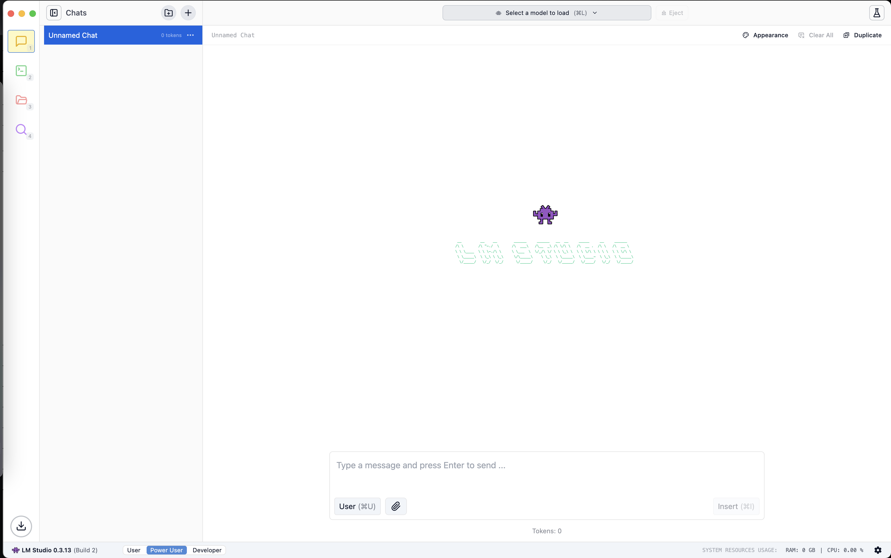

## 游닌 Sta쬰ní a instalace

1. Navštivte oficiální web LM Studia: [LM Studio](https://lmstudio.com)
    - Stránka by měla automaticky rozpoznat váš operační systém a nabídnout vám ho.

2. Stáhněte instalační soubor podle vašeho operačního systému.

---

3. Spusťte instalační soubor a postupujte podle pokynů.

---

4. Přesunutím souboru do slo쬶y "Aplikace" provedete instalaci

---

5. Aplikaci naleznete v Launchpad nebo přimo ve slo쬮e "Aplikace"

---

6. Kliknutím na ikonu otevřete aplikaci

